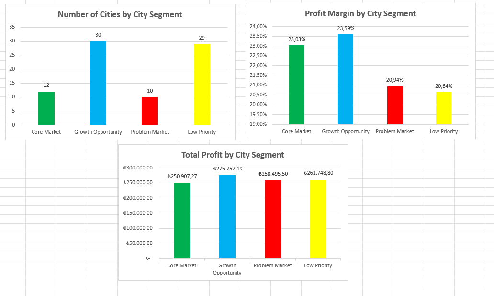

# Turkey Retail Sales Analysis with Dashboards
Excel-based sales and profitability analysis for a hypothetical Turkish retail company.

## Project Overview

This project analyzes 10,000 sales transactions to evaluate sales performance, profitability, regional performance and market opportunities across Turkey.
The project was developed using Microsoft Excel, with a focus on Pivot Tables, KPI analysis, market segmentation and dashboard visualization.

## Objectives

- Analyze overall sales and profitability
- Evaluate city-level performance
- Identify high-performing and underperforming markets
- Segment markets based on profit margin and order performance
- Build an Excel dashboard to support business decision-making

## Key Metrics

- Total Sales: ₺4,761,376.88
- Total Profit: ₺1,046,908.76
- Profit Margin: 22%
- Total Orders: 10,000
- Average Order Value: ₺476.14
- Average Orders per City: 123.46

## Key Insights

- **Growth Opportunity cities** stand out with the highest total profit of **₺275.8K** and the highest profit margin of **23.59%** across 30 cities. With ₺1.17M in sales, these markets offer strong potential for further growth and investment.

- **Low Priority cities** have the highest total sales at **₺1.27M**, but have the lowest profit margin at **20.64%**. This suggests that high sales volume alone does not indicate a high-priority market and highlights the need for profitability-focused optimization.

- **Problem Market cities** generate the second-highest total sales at **₺1.23M**, while achieving a relatively low profit margin of **20.94%**. These markets may benefit from strategies focused on improving profitability rather than simply increasing sales volume.

- **Core Market cities** achieve a healthy **23.03% profit margin** across 12 cities, indicating a relatively strong and established market base.

- The segmentation highlights the importance of evaluating **sales volume and profitability together**, rather than relying on sales alone when prioritizing markets.

## Recommendations

-**Invest** in **Growth Opportunity** cities: These markets combine strong profitability with growth potential. Increasing targeted marketing, customer acquisition and sales efforts could help capture additional market share while maintaining healthy margins.

-**Optimize Low Priority** cities: Although these cities generate the highest total sales (₺1.27M), their profit margin is the lowest (20.64%). Rather than focusing solely on increasing sales, businesses should review pricing, discounting and cost efficiency to improve profitability.

-**Improve profitability** in **Problem Markets**: With ₺1.23M in sales but only a 20.94% profit margin, these markets should be analyzed for potential issues such as excessive discounts, unfavorable product mix or higher operating costs before additional investment is made.

-**Maintain Core Markets**: Core Market cities demonstrate a strong 23.03% profit margin and represent an established customer base. The focus should be on customer loyalty, consistent service quality and protecting existing market share.

-**Prioritize profitability alongside sales**: Market investment decisions should consider both sales volume and profit margin. High-revenue markets should not automatically receive the highest investment if they generate relatively lower profitability.

## Tools & Skills

- Microsoft Excel
- Pivot Tables
- Pivot Charts
- KPI Analysis
- Data Analysis
- Dashboard Design
- Market Segmentation

## Project Structure

- `Turkey Retail Sales and Profitability Analysis.xlsx` — Main Excel analysis and dashboard

## Certificate

This project was developed alongside the **"Excel Pivot Tablolarla Veri Analizi"** training from BTK Akademi.
